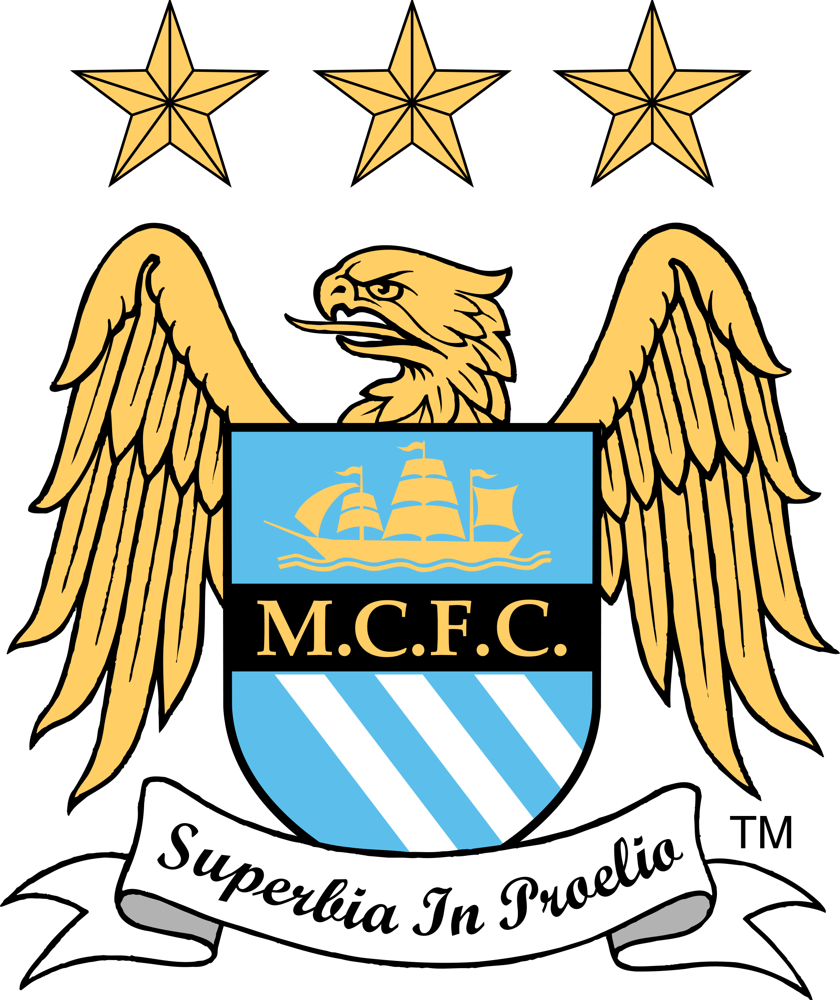

<h2>The Rise of Manchester City</h2>

Since the takeover by Abu Dhabi United Group in 2008, Manchester City Football Club moved up from mid-table to champions within a decade. This is a brief overview of their milestones since 2005. **Using the interactive graph below**, you can look at their historical performance (final league position, total points and total number of goals) over the last ten seasons.

 
