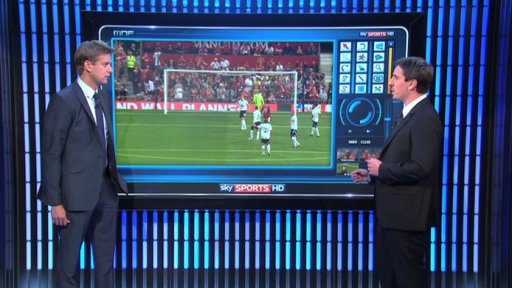

<h2>Predicting Football Matches Outcomes</h2>

Using the data I obtained from [football-data.co.uk](http://www.football-data.co.uk/) (also see section "Data Wrangling"), 
I created a simple predictive model for Premier League football. 
The following sub-sections explain the model building process in more details:

1. Data Preparation
2. Evaluating Variable Importance and Selecting Best Features
3. Tuning, Training and Validating Models

<h2>Advanced Example</h2>

The modelling example here only covers some basic steps. For a more advanced example using complex model ensemble methods, please see my previous project [World Cup 2014 Data Analysis and Predictions](https://github.com/woobe/wc2014).

 
