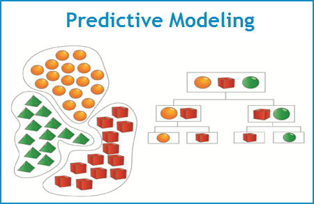

<center></center>

<br>

<center><h2>Parameters Tuning and Cross-Validation</h2></center>

I have justified why I should use all 13 features for the final model 
(see previous section "Feature Selection"). The next step is to determine the best 
model parameters and to estimate out-of-bag model performance.

For those purposes, I used a very handy R package called ```caret``` which
allows me to tune the parameter and to estimate model performance at the same time.

Since I am just going to build a single Random Forest model, there is only one paramter
to tune - ```mtry``` which is the number of variables randomly sampled 
as candidates at each split. The table below shows that the best ```mtry``` value 
is ```13``` and the estimated out-of-bag accuracy is about ```53.8%``` based on
five-fold cross-validation.
